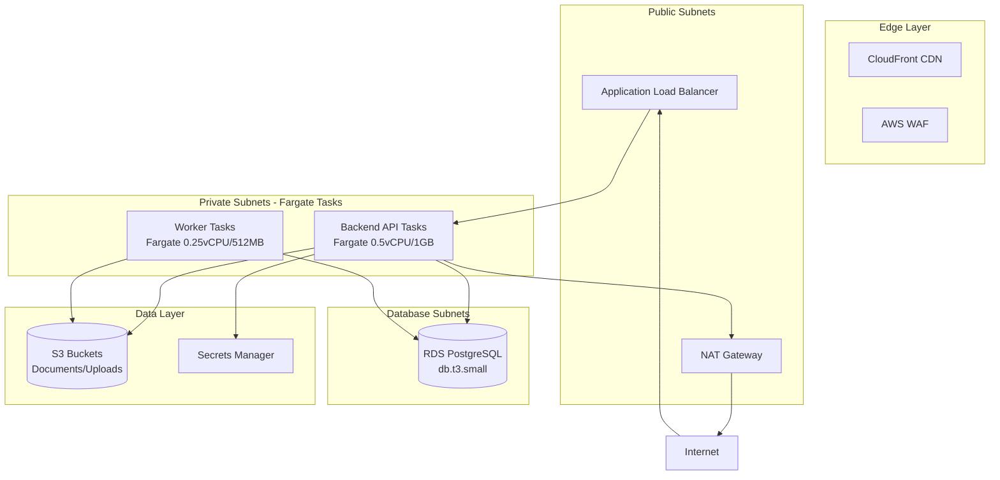
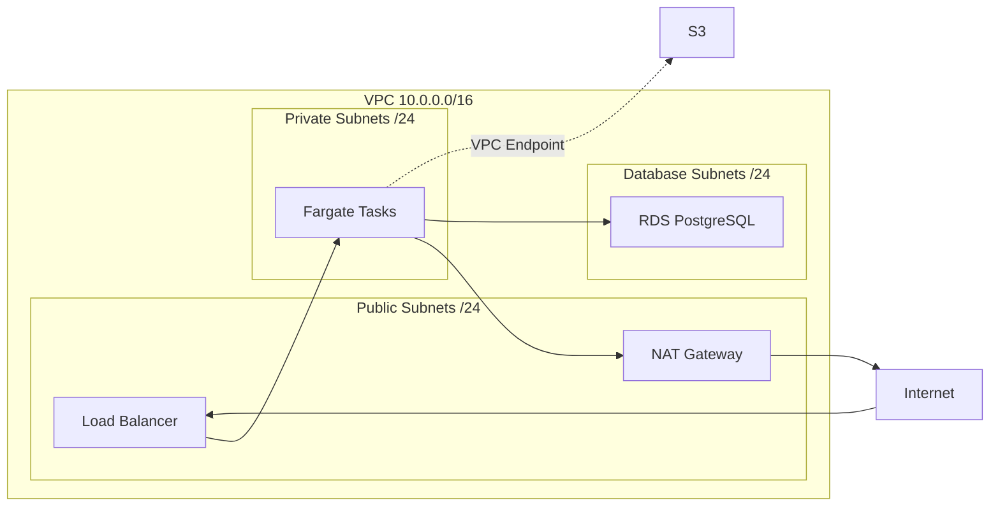

# Infrastructure Design Document

## Document Information

- **Version:** 1.1.0
- **Last Updated:** October 2025
- **Status:** Deployed (Dev), In Progress (Staging/Prod)
- **Architecture:** AWS Fargate-based Serverless Containers
- **Target Sprints:** Sprint 0-1 (Foundation)

## Version History

| Version | Date         | Changes                                                |
| ------- | ------------ | ------------------------------------------------------ |
| 1.0.0   | January 2025 | Initial design with EC2-based ECS                      |
| 1.1.0   | October 2025 | **BREAKING**: Migrated to AWS Fargate, removed EC2/ASG |

## Executive Summary

This document defines the **AWS Fargate-based infrastructure** for Paperwurks. The architecture uses fully managed services to minimize operational overhead while maintaining scalability and cost-efficiency.

**Key Architectural Decisions:**

- **AWS Fargate** (serverless containers) - No EC2 management
- **Managed Services** - RDS, S3, Secrets Manager, CloudWatch
- **VPC Gateway Endpoints** - S3 cost optimization
- **Multi-AZ Support** - Production high availability
- **Infrastructure as Code** - 100% Terraform managed

## Business Requirements

### Functional Requirements

- Support 100 concurrent users initially, scaling to 1000+
- Process 50-100 property documents daily
- Sub-30 second AI analysis response time
- 99.9% uptime SLA for core services
- 7-year document retention compliance

### Non-Functional Requirements

- GDPR compliance with UK data residency (eu-west-2)
- SOC 2 Type II compliance readiness
- RPO: 1 hour, RTO: 4 hours
- Multi-factor authentication support
- End-to-end encryption for sensitive data

---

## Architecture Overview

### High-Level Architecture



### Fargate Architecture Benefits

| Aspect         | Fargate                | Previous EC2 Approach      |
| -------------- | ---------------------- | -------------------------- |
| **Management** | Fully managed          | Manual instance management |
| **Scaling**    | Per-task, instant      | Per-instance, slower       |
| **Patching**   | Automatic              | Manual OS updates          |
| **Pricing**    | Pay per task-second    | Pay per instance-hour      |
| **Cost (Dev)** | £20/month              | £25/month                  |
| **Deployment** | Rolling, zero-downtime | Requires coordination      |

---

## Component Specifications

### Compute Resources (Fargate)

| Component       | CPU             | Memory  | Count | Scaling      | Environment |
| --------------- | --------------- | ------- | ----- | ------------ | ----------- |
| **Backend API** | 512 (0.5 vCPU)  | 1024 MB | 1-2   | Auto-scaling | Dev         |
| **Backend API** | 512 (0.5 vCPU)  | 1024 MB | 2     | Auto-scaling | Staging     |
| **Backend API** | 1024 (1 vCPU)   | 2048 MB | 2-4   | Auto-scaling | Prod        |
| **Worker**      | 256 (0.25 vCPU) | 512 MB  | 1     | Queue-based  | Dev         |
| **Worker**      | 256 (0.25 vCPU) | 512 MB  | 1     | Queue-based  | Staging     |
| **Worker**      | 512 (0.5 vCPU)  | 1024 MB | 2     | Queue-based  | Prod        |

**Network Mode**: `awsvpc` (each task gets dedicated ENI)  
**Launch Type**: `FARGATE` (serverless)

### Database Configuration

| Environment | Instance Class | Storage | Multi-AZ | Backup Retention |
| ----------- | -------------- | ------- | -------- | ---------------- |
| Dev         | db.t3.small    | 20 GB   | No       | 7 days           |
| Staging     | db.t3.small    | 20 GB   | No       | 7 days           |
| Prod        | db.t3.medium   | 100 GB  | Yes      | 30 days          |

**Engine**: PostgreSQL 15.8  
**Storage Type**: gp3 (General Purpose SSD)  
**Encryption**: AES-256 at rest, TLS in transit

### Storage Configuration

| Bucket                       | Purpose            | Versioning             | Lifecycle                            |
| ---------------------------- | ------------------ | ---------------------- | ------------------------------------ |
| `paperwurks-{env}-documents` | Property documents | Enabled (Staging/Prod) | 90d → IA, 365d → Glacier (Prod only) |
| `paperwurks-{env}-uploads`   | Temporary uploads  | Disabled               | 7d expiration                        |

**Access**: Private, pre-signed URLs  
**Encryption**: SSE-S3 (AES-256)

### Networking Architecture



**Key Features**:

- **VPC Gateway Endpoint for S3**: Eliminates NAT data transfer costs for S3 access
- **Private Subnets**: Fargate tasks have no direct internet access
- **NAT Gateway**: Single NAT for dev/staging, dual NAT for prod HA
- **Security Groups**: Least-privilege network access

### Cost Structure (Monthly Estimates)

| Environment | Compute (Fargate) | Database | Storage | Networking | Total       |
| ----------- | ----------------- | -------- | ------- | ---------- | ----------- |
| **Dev**     | £20               | £25      | £5      | £15        | **£65**     |
| **Staging** | £20               | £25      | £5      | £15        | **£65**     |
| **Prod**    | £80               | £100     | £50     | £50        | **£280**    |
| **Total**   | **£120**          | **£150** | **£60** | **£80**    | **£410/mo** |

**Cost Savings vs EC2 Approach**: ~20% (£100/month saved)

---

## Implementation Phases

### Phase 1: Foundation (Sprint 0-1) - 90% COMPLETE

**Status**: Deployed to Dev, In Progress

- VPC and networking setup (3 subnet tiers)
- Fargate cluster and services
- Application Load Balancer (public subnets)
- RDS PostgreSQL provisioning
- S3 buckets with lifecycle policies
- Secrets Manager integration
- CloudWatch monitoring and alarms
- VPC Gateway Endpoint for S3
- CI/CD pipeline (in progress)

**Remaining Work**:
- Deploy to staging - done
- Deploy to production
- Implement CI/CD automation

### Phase 2: Application Platform (Sprint 1-2) - NOT STARTED

- Backend application deployment
- Database migrations
- Application health checks
- Auto-scaling configuration
- Cache layer (ElastiCache Redis)
- Message queue (SQS)

### Phase 3: AI Infrastructure (Sprint 3-4) - NOT STARTED

- AWS Bedrock setup
- Knowledge base creation
- Model serving infrastructure
- RAG pipeline implementation

### Phase 4: Production Hardening (Sprint 5-6) - NOT STARTED

- Security audit implementation
- Disaster recovery testing
- Performance optimization
- Cost optimization review
- Documentation completion

---

## Deployment Architecture

### Fargate Service Configuration

```hcl
# Backend Service
resource "aws_ecs_service" "backend" {
  name            = "{env}-paperwurks-backend"
  cluster         = aws_ecs_cluster.main.id
  launch_type     = "FARGATE"
  desired_count   = 1-2 (environment dependent)

  network_configuration {
    subnets          = private_subnet_ids
    security_groups  = [ecs_security_group]
    assign_public_ip = false
  }

  load_balancer {
    target_group_arn = backend_target_group
    container_name   = "paperwurks-backend"
    container_port   = 8000
  }
}
```

**Key Features**:

- Rolling deployments with circuit breaker
- Health check grace period: 60 seconds
- Deregistration delay: 30 seconds
- Target type: `ip` (required for Fargate awsvpc mode)

### Security Architecture

**Network Security**:

```
Internet → WAF → ALB (public subnet)
       → Fargate (private subnet)
       → RDS (database subnet)
       → S3 (via VPC endpoint)
```

**Security Groups**:

- ALB SG: Allow 80/443 from 0.0.0.0/0
- ECS SG: Allow 8000 from ALB SG only
- RDS SG: Allow 5432 from ECS SG only

**Data Encryption**:

- At Rest: KMS encryption for RDS, S3 SSE
- In Transit: TLS 1.2+ for all connections
- Secrets: AWS Secrets Manager with rotation

---

## Monitoring & Observability

### CloudWatch Metrics

**ECS Metrics**:

- CPUUtilization (target: < 70%)
- MemoryUtilization (target: < 70%)
- Running task count

**ALB Metrics**:

- RequestCount
- TargetResponseTime (target: < 500ms)
- HTTPCode_Target_5XX_Count (alarm: > 10/min)
- HealthyHostCount (alarm: < 1)

**RDS Metrics**:

- CPUUtilization (alarm: > 80%)
- DatabaseConnections (alarm: > 80% max)
- FreeStorageSpace (alarm: < 5GB)
- FreeableMemory (alarm: < 256MB)

### Alerting Strategy

| Severity | Channel           | Response Time |
| -------- | ----------------- | ------------- |
| Critical | Email + PagerDuty | Immediate     |
| Warning  | Email + Slack     | 1 hour        |
| Info     | Slack only        | Best effort   |

### Log Aggregation

- Application logs: `/ecs/{env}-paperwurks-backend`
- Worker logs: `/ecs/{env}-paperwurks-worker`
- RDS logs: `/aws/rds/instance/{identifier}/postgresql`
- Retention: 7 days (dev), 14 days (staging), 30 days (prod)

---

## Disaster Recovery

### Backup Strategy

| Component          | Frequency          | Retention   | RPO       |
| ------------------ | ------------------ | ----------- | --------- |
| RDS Database       | Daily automated    | 7-30 days   | 24 hours  |
| S3 Documents       | Versioning enabled | Permanent   | Real-time |
| Application Config | IaC (Terraform)    | Git history | N/A       |

### Recovery Procedures

**RDS Failure**:

1. Automatic failover to standby (Multi-AZ, prod only): ~60 seconds
2. Point-in-time restore from backup: ~15 minutes
3. RTO Target: 1 hour

**Fargate Task Failure**:

1. ECS automatically replaces failed tasks
2. Health checks detect issues within 30 seconds
3. New tasks launched within 60 seconds
4. RTO Target: 2 minutes

**Complete Region Failure**:

1. Manual failover to DR region (if implemented)
2. Restore RDS from snapshot
3. Update DNS to DR ALB
4. RTO Target: 4 hours

---

## Compliance & Security

### GDPR Compliance

- Data residency in UK/EU (eu-west-2)
- Encryption at rest and in transit
- Right to be forgotten implementation (application layer)
- Data portability features (application layer)
- Audit trail for data access (CloudWatch logs)

### Security Compliance

- Infrastructure as Code (audit trail)
- Secrets Manager (no hardcoded credentials)
- VPC isolation (private subnets)
- Security groups (least privilege)
- Penetration testing (pending)
- Vulnerability scanning (pending CI/CD integration)

---

## Known Issues & Limitations

### Current Issues (October 2025)

1. **RDS Log Group Auto-Creation**: RDS automatically creates CloudWatch log groups when `enabled_cloudwatch_logs_exports` is set. Terraform tries to manage this, causing conflicts. **Fix**: Import existing log group into state.

2. **VPC Endpoint Deletion Order**: S3 VPC Gateway Endpoint blocks VPC deletion due to implicit route table dependencies. **Fix**: Add lifecycle rules or manual deletion before VPC destroy.

3. **Secrets Manager Deletion**: Secrets have 7-30 day recovery window. **Fix**: Use `force-delete-without-recovery` for non-prod or wait for recovery period.

### Limitations

- **No Auto-Scaling**: Currently fixed task counts. Auto-scaling policies pending.
- **Single NAT Gateway**: Dev/staging use single NAT (cost optimization). Production uses dual NAT for HA.
- **No CDN**: CloudFront not yet configured for static assets.
- **No WAF**: Web Application Firewall pending security review.

---

## Future Enhancements

### Short-term (Next Sprint)

- CI/CD pipeline automation
- Auto-scaling policies for Fargate tasks
- ElastiCache Redis for session storage
- SQS for background job queue

### Medium-term (Next Quarter)

- CloudFront CDN for static assets
- AWS WAF with managed rule sets
- X-Ray distributed tracing
- Container Insights for detailed metrics

### Long-term (6+ months)

- Multi-region deployment for DR
- AWS Bedrock integration for AI features
- Blue/green deployment strategy
- Cost optimization with Fargate Spot

---

## Appendices

### A. Terraform Module Structure

```
infrastructure/
├── setup/              # Shared resources (IAM, ECR, S3 backend)
├── modules/
│   ├── networking/     # VPC, subnets, security groups
│   ├── compute/        # Fargate cluster, services, ALB
│   ├── database/       # RDS, parameter groups, secrets
│   ├── storage/        # S3 buckets, policies
│   └── monitoring/     # CloudWatch, SNS, dashboards
└── environments/
    ├── dev/           # Development environment
    ├── staging/       # Staging environment
    └── prod/          # Production environment
```

### B. Valid Fargate CPU/Memory Combinations

| CPU (vCPU) | Valid Memory (MB)                        |
| ---------- | ---------------------------------------- |
| 256 (.25)  | 512, 1024, 2048                          |
| 512 (.5)   | 1024, 2048, 3072, 4096                   |
| 1024 (1)   | 2048, 3072, 4096, 5120, 6144, 7168, 8192 |
| 2048 (2)   | 4096-16384 (1024 MB increments)          |
| 4096 (4)   | 8192-30720 (1024 MB increments)          |

### C. Useful Commands

```bash
# Check Fargate task status
aws ecs list-tasks --cluster paperwurks-dev-cluster

# View task logs
aws logs tail /ecs/dev-paperwurks-backend --follow

# Check ALB target health
aws elbv2 describe-target-health --target-group-arn <arn>

# Force delete scheduled secret
aws secretsmanager delete-secret \
  --secret-id paperwurks/dev/database/master-credentials \
  --force-delete-without-recovery

# Import existing log group
terraform import 'module.database.aws_cloudwatch_log_group.postgresql' \
  '/aws/rds/instance/paperwurks-dev-db/postgresql'
```

---

## Contact & Support

- **Infrastructure Issues**: #infrastructure Slack channel
- **On-Call**: PagerDuty escalation
- **Documentation**: This file + module READMEs
- **Runbooks**: `/docs/runbooks/` (pending)

---

**Document Maintained By**: DevOps Team  
**Review Frequency**: Monthly or after major changes  
**Next Review**: November 2025
